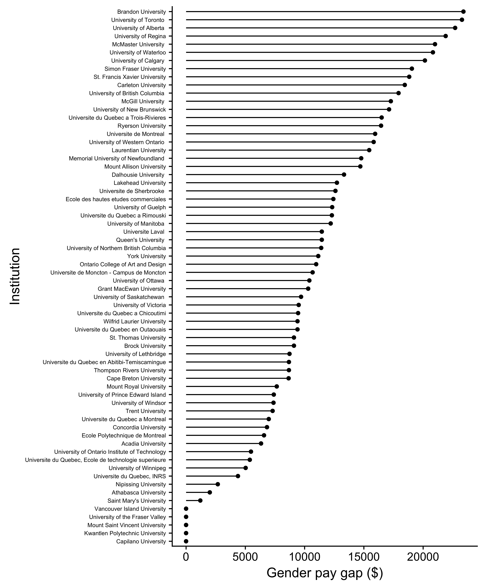
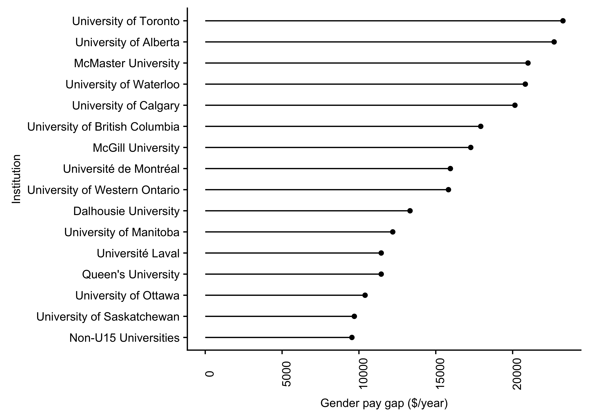

The gender pay gap at Canadian universities
================
Megan Frederickson
2018-05-24

This repository is part of an ongoing effort to gather, analyze, and share data on gender equity among Canadian academics. I provide all data and code so that anyone, anywhere can replicate or expand on my analyses. These analyses also accompany a story I wrote for <i>The Conversation</i>: <https://theconversation.com/canadian-professors-still-face-a-gender-pay-gap-93609>

Statistics Canada
-----------------

Statistics Canada collected data on the number and salaries of full-time academic staff at Canadian universities in 2016-2017. The data come from the Full-time-University and College Academic Staff System (FT-UCASS). I downloaded the data on February 11, 2018. Note that data are available only for the 66 institutions that had at least 100 full-time teaching staff in 2016-2017. The citation is:

Statistics Canada. Table 477-0123 - Number and salaries of full-time teaching staff at canadian universities, occasional (number unless otherwise noted), CANSIM (database). (accessed: 11 Feb 2018)

See: <http://www.statcan.gc.ca/daily-quotidien/171128/dq171128b-cansim-eng.htm>

### Getting started

First we need to load some useful R packages.

``` r
#Load useful packages
library(tidyverse) #includes ggplot2, dplyr, readr, stringr
library(cowplot)
library(foreign)
library(gender)
library(knitr)
library(data.table)
library(reshape2)
```

Next, we need to load and clean the data.

``` r
#Read in data
data <- read.csv("https://raw.githubusercontent.com/drfreder/statscan-gender/master/statscan_11feb2018.csv")

#Subset to include only number, median, and average salaries of male and female faculty
data <- subset(data, RAN=="Male"|RAN=="Female")

#Subset and combine to re-format
data_num <- subset(data, STA=="Total teaching staff")
data_median <- subset(data, STA=="Median (dollars)")
data_average <- subset(data, STA=="Average (dollars)")
mdata <- cbind(data_num[,3:6],data_median[,3:6],data_average [,3:6])

#Make sure things match before deleting duplicated columns
mdata$Match <- mdata[ ,1] == mdata[ ,5]
mdata$Match2 <- mdata[ ,1] == mdata[ ,9]
tmp <- ifelse((all(mdata$Match) && all(mdata$Match2)), mdata <- mdata[,c(-5,-6, -9,-10, -13,-14)], FALSE)

#Rename columns
colnames(mdata) <- c("University", "Gender", "STA", "Total_staff", "STA.1", "Median", "STA.2", "Average")

#Remove unnecessary columns
mdata <- mdata[,c(-3,-5,-7)]

#Fix data types
mdata$Median <- as.numeric(as.character(mdata$Median))
mdata$Average <- as.numeric(as.character(mdata$Average))
mdata$Total_staff <- as.numeric(as.character(mdata$Total_staff))
mdata$University <- as.character(mdata$University)

#Fix accents in French university names
mdata$University <- enc2native(mdata$University)
mdata$University <- gsub(enc2utf8("<83>"),"E", mdata$University)
mdata$University <- gsub(enc2utf8("<8e>"),"e", mdata$University)
mdata$University <- gsub(enc2utf8("<88>"),"a", mdata$University)
mdata$University <- gsub(enc2utf8("<8f>"),"e", mdata$University)

#Omit rows that exclude medical and dental teaching staff
mdata <- mdata[!grepl(".*Excluding.*", mdata$University), ]
mdata$University <- gsub("- Including medical dental", "", mdata$University)

#Reshape data so that each university is a row
median_sum <- dcast(mdata, University~Gender, value.var="Median")
median_n <- dcast(mdata, University~Gender, value.var="Total_staff")
median_n$total <- median_n$Male+median_n$Female
median_sum$dif <- median_sum$Male - median_sum$Female
median_sum$percent <- median_sum$Female / median_sum$Male
median_sum$total <- median_n$total
median_n$percent_female <- median_n$Female / median_n$total
median_sum$percent_female <- median_n$percent_female

#Shorten one university name
median_sum[median_sum$University=="Universite du Quebec, Institut national de la recherche scientifique", "University"] <- "Universite du Quebec, INRS"
```

### Calculate the gender pay gap

The gender pay gap is most often presented as the ratio of median female to median male salary, or in other words, how many cents women earn for every dollar earned by men. Here, I visualize the gender pay gap in two ways. First, for each institution, I plot the median female salary as a percent of median male salary (i.e., median female salary/median male salary), as is conventional. Second, for each institution, I also plot the simple difference in median salary between male and female faculty (i.e., median male salary - median female salary). I actually like the second way better; in high-paying professions, even if women are paid just a few percent less than men, this can result in a substantial loss of income in absolute dollars.

``` r
#Plot the gender wage gap, as a percent, for 66 Canadian institutions
p1 <- ggplot() +
      geom_point(data=median_sum, aes(x=reorder(University, -percent), y=as.numeric(percent*100)))+
      scale_y_continuous(limits=c(80, 100))+
      coord_flip()+
      xlab("Institution")+
      ylab("Gender pay gap (%)")+
      geom_segment(data=median_sum, aes(x=reorder(University, dif),
                   xend=reorder(University, dif), 
                   y=100, 
                   yend=as.numeric(percent*100)))+
      theme(axis.text.y = element_text(size=6))

#Plot the gender wage gap, in dollars, for 66 Canadian institutions
p2 <- ggplot(data=median_sum, aes(x=reorder(University, dif), y=as.numeric(dif)))+
      geom_point()+
      coord_flip()+
      xlab("Institution")+
      ylab("Gender pay gap ($)")+
      geom_segment(aes(x=reorder(University, dif),
                   xend=reorder(University, dif), 
                   y=0, 
                   yend=as.numeric(dif)))+
      theme(axis.text.y = element_text(size=6))
```

#### Female professors earn less than male professors at most Canadian universities

Median female salary as a percent of median male salary:

``` r
p1
```


In absolute dollars:

``` r
p2
```



### Focus on the U15

Canada's 15 research-intensive universities are known as the U15. For brevity, I focused on these 15 institutions when writing my story for <i>The Conversation</i>. The following code creates the figure that appeared in my article.

``` r
#Trim whitespace from university names
median_sum$University <- trimws(median_sum$University, which="both")

#Make a vector of U15 university names
U15 <- c("University of Alberta", "University of British Columbia", "University of Calgary", "Dalhousie University", "Universite Laval", "University of Manitoba","McGill University", "McMaster University", "Universite de Montreal", "University of Ottawa", "Queen's University", "University of Saskatchewan", "University of Toronto", "University of Waterloo","University of Western Ontario")

#Create a column indicating whether the university is in the U15
median_sum$U15 <- as.character(median_sum$University %in% U15)

#Subset to just the U15
U15 <- subset(median_sum, U15==TRUE)

#Calculate the mean gender pay gap for all non-U15 universities
nU15 <- subset(median_sum, U15==FALSE)
mean_dif_noU15 <- mean(nU15$dif)
se_dif_noU15 <- sd(U15$dif)/sqrt(length(nU15$dif))
U15red <- U15[c("University","dif")]
newRow <- data.frame(University="Non-U15 Universities", dif=mean_dif_noU15)

#Combine U15 data and means for non-U15 institutions
U15red <- rbind(U15red, newRow)

#Add French accents
U15red$University <- gsub("Universite Laval", "Universit\uE9 Laval", U15red$University)
U15red$University <- gsub("Universite de Montreal", "Universit\uE9 de Montr\u{E9}al", U15red$University)

#Plot the gender wage gap, in dollars, for the U15
p3 <- ggplot(data=U15red, aes(x=reorder(University, dif), y=as.numeric(dif)))+
      geom_point()+
      coord_flip()+
      xlab("Institution")+
      ylab("Gender pay gap ($/year)")+
      geom_segment(aes(x=reorder(University, dif),
                   xend=reorder(University, dif), 
                   y=0, 
                   yend=as.numeric(dif)))+
      theme(text = element_text(size=10),
            axis.text = element_text(size=10),
            axis.text.x = element_text(angle=90))
p3
```


