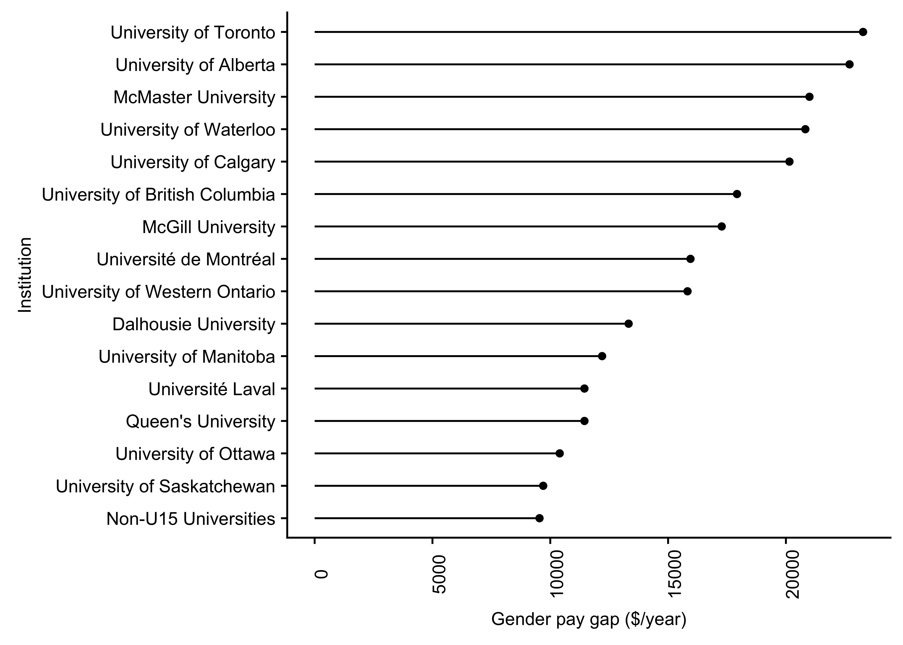
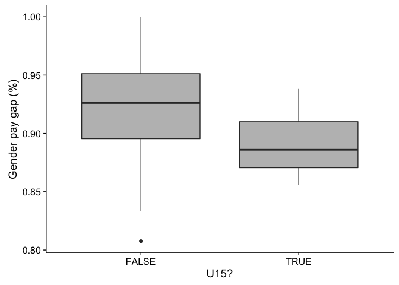
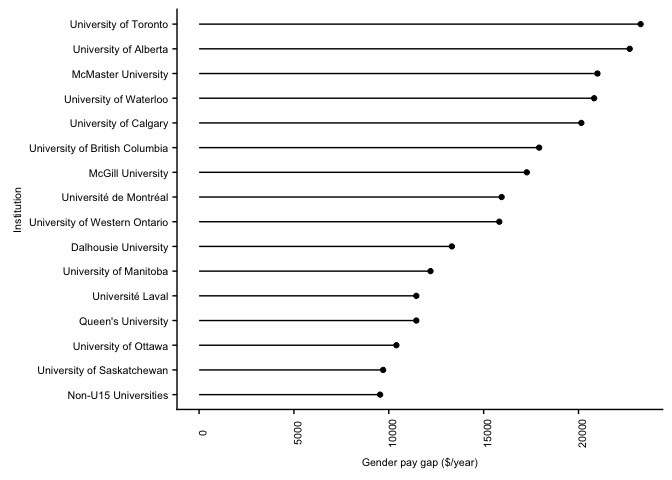

The gender pay gap at Canadian universities
================
Megan Frederickson
2018-04-23

Statistics Canada
-----------------

Statistics Canada collected data on the number and salaries of full-time teaching staff at Canadian universities in 2016-2017. The data come from the Full-time-University and College Academic Staff System (FT-UCASS). I downloaded the data on February 11, 2018. Note that data are available only for the 66 institutions that had at least 100 full-time teach staff.

Load packages and data
----------------------

``` r
#Load useful packages
library(tidyverse) #includes ggplot2, dplyr, readr, stringr
library(cowplot)
library(car)
library(glmm)
library(nlme)
library(lme4)
library(predictmeans)
library(foreign)
library(gender)
library(knitr)
library(kableExtra)
library(data.table)
library(reshape2)

#Read in data
data <- read.csv("https://raw.githubusercontent.com/drfreder/statscan-gender/master/statscan_11feb2018.csv")

#The data is not formatted as we will need it
#Subset to include only number, median, and average salaries of male and female faculty
data <- subset(data, RAN=="Male"|RAN=="Female")

#Subset to include just number of faculty
data_num <- subset(data, STA=="Total teaching staff")

#Subset to include just median salary
data_median <- subset(data, STA=="Median (dollars)")

#Subset to include just average salary
data_average <- subset(data, STA=="Average (dollars)")

#Combine subsets
mdata <- cbind(data_num[,3:6],data_median[,3:6],data_average [,3:6])

#Make sure things match before deleting duplicated columns
mdata$Match <- mdata[ ,1] == mdata[ ,5]
mdata$Match2 <- mdata[ ,1] == mdata[ ,9]
tmp <- ifelse((all(mdata$Match) && all(mdata$Match2)), mdata <- mdata[,c(-5,-6, -9,-10, -13,-14)], FALSE)
colnames(mdata) <- c("University", "Gender", "STA", "Total_staff", "STA.1", "Median", "STA.2", "Average")
mdata <- mdata[,c(-3,-5,-7)]

#Fix data types
mdata$Median <- as.numeric(as.character(mdata$Median))
mdata$Average <- as.numeric(as.character(mdata$Average))
mdata$Total_staff <- as.numeric(as.character(mdata$Total_staff))
mdata$University <- as.character(mdata$University)

#Fix accents in French university names
mdata$University <- enc2native(mdata$University)
mdata$University <- gsub(enc2utf8("<83>"),"E", mdata$University)
mdata$University <- gsub(enc2utf8("<8e>"),"e", mdata$University)
mdata$University <- gsub(enc2utf8("<88>"),"a", mdata$University)
mdata$University <- gsub(enc2utf8("<8f>"),"e", mdata$University)

#Exclude rows that exclude medical and dental teaching staff
mdata <- mdata[!grepl(".*Excluding.*", mdata$University), ]
mdata$University <- gsub("- Including medical dental", "", mdata$University)

#Reshape data so that each university is a row
median_sum <- dcast(mdata, University~Gender, value.var="Median")
median_n <- dcast(mdata, University~Gender, value.var="Total_staff")
median_n$total <- median_n$Male+median_n$Female
median_sum$dif <- median_sum$Male - median_sum$Female
median_sum$percent <- median_sum$Female / median_sum$Male
median_sum$total <- median_n$total
median_n$percent_female <- median_n$Female / median_n$total
median_sum$percent_female <- median_n$percent_female

#Shorten one university name
median_sum[median_sum$University=="Universite du Quebec, Institut national de la recherche scientifique", "University"] <- "Universite du Quebec, INRS"
```

Visualize data
--------------

``` r
#Visualize gender pay gap two different ways

#Gender wage gap in dollars
p1 <- ggplot(data=median_sum, aes(x=reorder(University, dif), y=as.numeric(dif)))+
      geom_point()+
      coord_flip()+
      xlab("Institution")+
      ylab("Gender pay gap ($)")+
      geom_segment(aes(x=reorder(University, dif),
                   xend=reorder(University, dif), 
                   y=0, 
                   yend=as.numeric(dif)))+
      theme(axis.text.y = element_text(size=12))
p1
```


``` r
#Gender wage gap, as percent 
p2 <- ggplot() +
      geom_point(data=median_sum, aes(x=reorder(University, -percent), y=as.numeric(percent)))+
      scale_y_continuous(limits=c(0.73,1.0))+
      coord_flip()+
      xlab("Institution")+
      ylab("Gender pay gap")+
      geom_segment(data=median_sum, aes(x=reorder(University, dif),
                   xend=reorder(University, dif), 
                   y=1.0, 
                   yend=as.numeric(percent)))+
      theme(axis.text.y = element_text(size=8))
p2
```


Determine whether U15 is worse than other universities
------------------------------------------------------

``` r
#Trim whitespace from university names
median_sum$University <- trimws(median_sum$University, which="both")

#Make a vector of U15 university names
U15 <- c("University of Alberta", "University of British Columbia", "University of Calgary", "Dalhousie University", "Universite Laval", "University of Manitoba","McGill University", "McMaster University", "Universite de Montreal", "University of Ottawa", "Queen's University", "University of Saskatchewan", "University of Toronto", "University of Waterloo","University of Western Ontario")

#Create a column indicating whether the university is in the U15
median_sum$U15 <- as.character(median_sum$University %in% U15)

#Visualize data
p7 <- ggplot(data=median_sum, aes(x=U15, y=as.numeric(dif)))+geom_boxplot(fill="grey")+
      xlab("U15?")+
      ylab("Gender pay gap ($)")
p7
```



``` r
#Visualize data
p8 <- ggplot(data=median_sum, aes(x=U15, y=as.numeric(percent)))+geom_boxplot(fill="grey")+
      xlab("U15?")+
      ylab("Gender pay gap (%)")
p8
```



``` r
#Visualize data
U15 <- subset(median_sum, U15==TRUE)
nU15 <- subset(median_sum, U15==FALSE)
mean_dif_noU15 <- mean(nU15$dif)
se_dif_noU15 <- sd(U15$dif)/sqrt(length(nU15$dif))
U15red <- U15[c("University","dif")]
newRow <- data.frame(University="Non-U15 Universities", dif=mean_dif_noU15)
U15red <- rbind(U15red, newRow)

#Add French accents
U15red$University <- gsub("Universite Laval", "Universit\uE9 Laval", U15red$University)
U15red$University <- gsub("Universite de Montreal", "Universit\uE9 de Montr\u{E9}al", U15red$University)

p1 <- ggplot(data=U15red, aes(x=reorder(University, dif), y=as.numeric(dif)))+
      geom_point()+
      coord_flip()+
      xlab("Institution")+
      ylab("Gender pay gap ($/year)")+
      geom_segment(aes(x=reorder(University, dif),
                   xend=reorder(University, dif), 
                   y=0, 
                   yend=as.numeric(dif)))+
      theme(text = element_text(size=8),
            axis.text = element_text(size=8),
            axis.text.x = element_text(angle=90))
p1
```


